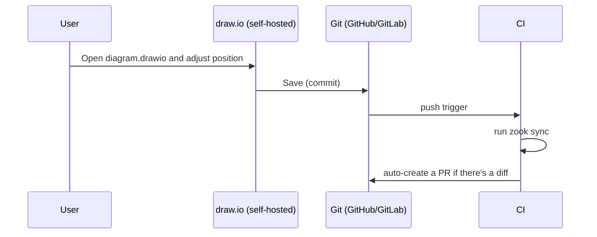

# draw.io Integration (Continuous Diagram Management)

[🇯🇵 日本語版](/zook/ja/drawio-sync/){ .md-button }

Hand-tune a diagram generated by zook in [draw.io](https://www.diagrams.net/), and mechanically feed its position/size changes back into the YAML. This feature is built for continuously updating and managing a diagram over time, not just a one-shot generate-and-done workflow.

## What It Can and Can't Do

- **Can**: reflect position/size changes made to elements in draw.io as `x`/`y`/`width`/`height` in the YAML
- **Can't**: reflect adding/removing nodes and containers, or color/style changes. Keep doing those in the YAML

Not syncing additions, removals, and color changes isn't a limitation — it's a design decision. To keep the YAML as the single source of truth, the feature is deliberately scoped to position/size sync only.

## Basic Flow

```bash
# 1. Export the base diagram in draw.io format
zook export-drawio diagram.yaml -o diagram.drawio

# 2. Open it in draw.io, adjust position/size, and save

# 3. Feed the changes back into the YAML
zook sync diagram.yaml diagram.drawio -o diagram.yaml
```

`sync` first runs the original YAML through auto-layout to compute "where each element was meant to be placed," then compares that against the actual position/size in draw.io. Only elements with an actual difference get explicit coordinates (`x`/`y`/`width`/`height`) written, so untouched elements stay auto-placed.

```bash
$ zook sync diagram.yaml diagram.drawio -o diagram.yaml
Warning: element 'old-node' not found in 'diagram.drawio' - was it deleted in draw.io? structural changes aren't synced; edit the YAML directly if intentional
Wrote diagram.yaml
```

- A known element that's missing from the draw.io side (possibly deleted) → Warning. The YAML is not changed
- A shape added on the draw.io side that isn't in the YAML → Warning. Ignored

Both are Warnings that let execution continue, never Fatal (the same policy as zook's [error handling](usage.md#error-handling)).

## Icon Appearance

`export-drawio` writes out the major AWS services and containers using draw.io's official AWS4 shape library (giving the familiar official look inside draw.io). Anything without a corresponding official shape (every GCP/Azure type, some AWS actor icons, etc.) gets zook's own PNG icon embedded as-is.

## Automating via Git Integration (Recommended Workflow)

Self-hosted draw.io has GitHub/GitLab integration that lets you open, edit, and save (commit) a `.drawio` file directly from your repository. That save triggers `.github/workflows/drawio-sync.yml`, which automatically runs `zook sync` and opens a Pull Request with the updated YAML.



- Files are matched by a **same-basename convention** (`diagram.yaml` ⇔ `diagram.drawio`, same directory)
- If `sync` produces no diff (e.g. only a color change was made — something out of sync's scope), no PR is created
- Since this opens a PR rather than committing directly, it doesn't conflict with protected-branch policies, and gives you a chance to review before merging

## Why draw.io

Using PowerPoint itself as the hand-tuning editor was also considered, but draw.io was chosen for these reasons:

- A pptx group (container) carries a child coordinate system offset/scale (`chOff`/`chExt`) — resizing a group in PowerPoint implicitly scales its children's coordinates. draw.io's container (`container=1`) is a simpler model where a child's coordinates aren't scaled on resize
- draw.io's file format (mxGraph XML) is text, so it diffs cleanly in Git — a good fit for continuous management and review
- It can be self-hosted, so diagrams (which can carry sensitive information) never need to leave your own infrastructure
- Official AWS/GCP/Azure icon libraries are built in
