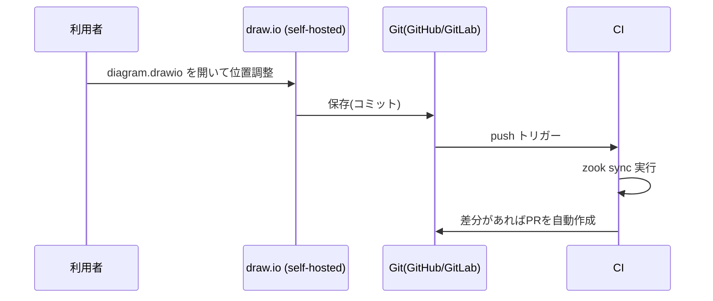

# draw.io連携(継続的な構成図管理)

zookで生成した構成図を[draw.io](https://www.diagrams.net/)で手直しし、その位置・サイズの変更をYAMLに機械的に反映できます。ワンショットで生成して終わりではなく、構成図を継続的に更新・管理していく運用を想定した機能です。

## できること・できないこと

- **できる**:draw.io上で要素の位置・サイズを変更したものを、YAMLの`x`/`y`/`width`/`height`として反映する
- **できない**:ノード・コンテナの追加/削除、色やスタイルの変更を反映する。これらは引き続きYAML側で行ってください

追加・削除・色変更を反映しないのは制約ではなく設計判断です。YAMLを唯一の真実源として保ち続けるための境界線として、位置・サイズの同期だけに機能を絞っています。

## 基本フロー

```bash
# 1. ベースの構成図をdraw.io形式で書き出す
zook export-drawio diagram.yaml -o diagram.drawio

# 2. draw.io で開いて位置・サイズを調整し、保存する

# 3. 変更をYAMLに反映する
zook sync diagram.yaml diagram.drawio -o diagram.yaml
```

`sync`は元のYAMLを一度自動レイアウトにかけ、「本来ならどこに配置されるはずだったか」を計算した上で、実際にdraw.io上に置かれた位置・サイズと比較します。**差分がある要素だけ**明示座標(`x`/`y`/`width`/`height`)を書き込むため、触っていない要素は自動配置のまま維持されます。

```bash
$ zook sync diagram.yaml diagram.drawio -o diagram.yaml
Warning: element 'old-node' not found in 'diagram.drawio' - was it deleted in draw.io? structural changes aren't synced; edit the YAML directly if intentional
Wrote diagram.yaml
```

- 既知の要素がdraw.io側で見つからない(削除された可能性がある)→ Warning。YAMLは変更されません
- draw.io側にYAMLにない図形が追加されている → Warning。無視されます

いずれもFatalではなく継続可能なWarningです(zookの[エラーハンドリング](usage.md#error-handling)方針と同じ)。

## アイコンの見た目

`export-drawio`は、AWSの主要サービス・コンテナについてはdraw.io公式のAWS4シェイプライブラリを使って書き出します(draw.io上で見慣れた公式の見た目になります)。対応する公式シェイプが無いもの(GCP/Azureの全種別、AWSの一部アクターアイコン等)は、zook自身のPNGアイコンをそのまま埋め込みます。

## Git連携での自動化(推奨運用)

self-hosted draw.io にはGitHub/GitLab連携機能があり、リポジトリ上の`.drawio`ファイルを直接開いて編集・保存(コミット)できます。この保存をトリガーに、`.github/workflows/drawio-sync.yml`が自動的に`zook sync`を実行し、更新されたYAMLをPull Requestとして自動作成します。



- 対応関係は**同名ファイル規約**(`diagram.yaml` ⇔ `diagram.drawio`、同ディレクトリ)です
- `sync`実行結果に差分が無ければ(例:色だけ変更した等、同期対象外の変更のみだった場合)PRは作成されません
- 直接コミットではなくPRを作成する方式なので、保護ブランチのポリシーとも衝突せず、マージ前にレビューを挟めます

## なぜdraw.ioなのか

PowerPointを手直し用のエディタとして使う案も検討しましたが、以下の理由でdraw.ioを採用しています。

- pptxのグループ(コンテナ)は`chOff`/`chExt`という子座標系のオフセット・スケールを持ち、PowerPoint上でグループをリサイズすると子要素の座標が暗黙にスケーリングされる。draw.ioのコンテナ(`container=1`)はリサイズしても子要素の座標がスケールされない、より単純なモデル
- draw.ioのファイル形式(mxGraph XML)はテキストなのでgit diffが取れる。継続的な管理・レビューと相性が良い
- セルフホストできるため、構成図(機密性のある情報になりうる)を社外のクラウドサービスに預けずに完結できる
- AWS/GCP/Azureの公式アイコンライブラリが標準搭載されている
