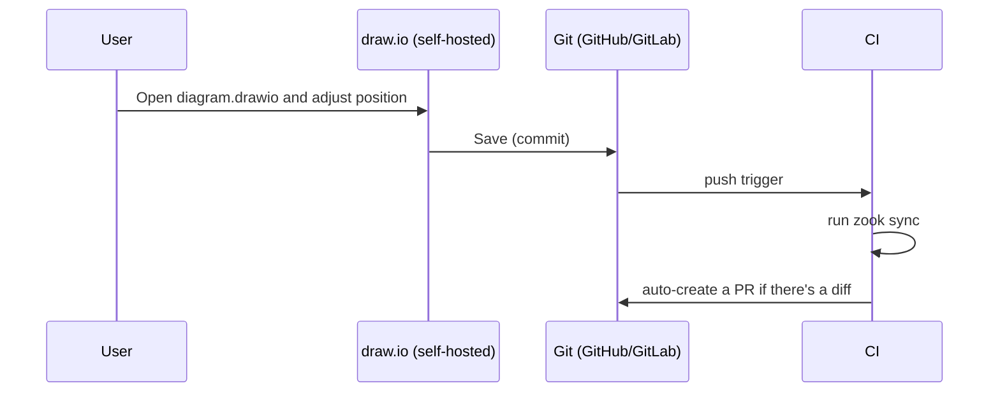

# draw.io Integration (Continuous Diagram Management)

[🇯🇵 日本語版](/zook/ja/drawio-sync/){ .md-button }

Hand-tune a diagram generated by zook in [draw.io](https://www.diagrams.net/), and mechanically feed its position/size changes back into the YAML. This feature is built for continuously updating and managing a diagram over time, not just a one-shot generate-and-done workflow.

## What It Can and Can't Do

- **Can**: reflect position/size changes made to elements in draw.io as `x`/`y`/`width`/`height` in the YAML, and bend points added to (or removed from) a link as its `waypoints`
- **Can't**: reflect adding/removing nodes, containers or links, moving an element into another container, or color/style/label changes. Keep doing those in the YAML — sync reports each such edit as a Warning rather than silently ignoring it

Not syncing additions, removals, and color changes isn't a limitation — it's a design decision. To keep the YAML as the single source of truth, the feature is deliberately scoped to position/size sync only.

## Basic Flow

```bash
# 1. Export the base diagram in draw.io format
zook export-drawio diagram.yaml -o diagram.drawio

# 2. Open it in draw.io, adjust position/size, and save

# 3. Feed the changes back into the YAML
zook sync diagram.yaml diagram.drawio -o diagram.yaml
```

`export-drawio` records, in a hidden cell of the .drawio file, where it placed every element. `sync` compares the draw.io file against that record, so only what was actually **edited in draw.io** is written back — as explicit coordinates (`x`/`y`/`width`/`height`) — and untouched elements stay auto-placed. Because the comparison is against the export, a .drawio exported *before* you changed the YAML doesn't pin everything back to its old position: sync warns that the YAML changed since the export, and writes only the draw.io edits. (A .drawio exported by an older zook has no record; then the YAML's current layout is the baseline.)

Moving one auto-placed element takes it out of its container's automatic arrangement, which would re-pack its siblings. So after writing the edits, sync lays the YAML out again and also pins any element that no longer lands where the .drawio showed it, until the two agree. If nothing was moved, sync doesn't rewrite the YAML at all; when it does, it keeps the file's comments, key order and indentation style.

```bash
$ zook sync diagram.yaml diagram.drawio -o diagram.yaml
Warning: element 'old-node' not found in 'diagram.drawio' - was it deleted in draw.io? structural changes aren't synced; edit the YAML directly if intentional
Wrote diagram.yaml
```

- A known element that's missing from the draw.io side (possibly deleted) → Warning. The YAML is not changed
- A shape or link added on the draw.io side that isn't in the YAML → Warning. Ignored
- An element dragged into a different container, a relabelled element or link, a reconnected link → Warning. Not applied
- A shape draw.io wrapped in an `<object>`/`<UserObject>` (it does that once a shape gets a link or tooltip) is synced like any other
- A .drawio with several pages: the page zook exported (`id="zook"`) is synced; otherwise the first page, with a Warning

Both are Warnings that let execution continue, never Fatal (the same policy as zook's [error handling](usage.md#error-handling)).

## Icon Appearance

`export-drawio` writes out the major AWS services and containers using draw.io's official AWS4 shape library (giving the familiar official look inside draw.io). Anything without a corresponding official shape (every GCP/Azure type, some AWS actor icons, etc.) gets zook's own PNG icon embedded as-is.

## Automating via Git Integration (Recommended Workflow)

Self-hosted draw.io has GitHub/GitLab integration that lets you open, edit, and save (commit) a `.drawio` file directly from your repository. That save triggers `.github/workflows/drawio-sync.yml`, which automatically runs `zook sync` and opens a Pull Request with the updated YAML.



- Files are matched by a **same-basename convention** (`diagram.yaml` ⇔ `diagram.drawio`, same directory)
- If `sync` produces no diff (e.g. only a color change was made — something out of sync's scope), no PR is created
- Since this opens a PR rather than committing directly, it doesn't conflict with protected-branch policies, and gives you a chance to review before merging
- Every `.drawio` added or modified by the push is synced (all commits of a multi-commit push; file names with spaces or non-ASCII characters are fine); a deleted `.drawio` is skipped. A sync failure is reported as an annotation and fails the run after the PR for the others is opened

### Using the workflow in your own repository

1. Copy [`.github/workflows/drawio-sync.yml`](https://github.com/taka-sho/zook/blob/main/.github/workflows/drawio-sync.yml) into your repository's `.github/workflows/`.
2. Replace its `pip install -e .` step (which installs zook from the zook repository itself) with `pip install zook` — or, until zook is published on PyPI, `pip install git+https://github.com/taka-sho/zook`.
3. In your repository's **Settings → Actions → General → Workflow permissions**, select **Read and write permissions** and tick **Allow GitHub Actions to create and approve pull requests** — without them the PR step fails.
4. Keep each diagram's `.yaml` next to its `.drawio` under the same base name.

## Why draw.io

Using PowerPoint itself as the hand-tuning editor was also considered, but draw.io was chosen for these reasons:

- A pptx group (container) carries a child coordinate system offset/scale (`chOff`/`chExt`) — resizing a group in PowerPoint implicitly scales its children's coordinates. draw.io's container (`container=1`) is a simpler model where a child's coordinates aren't scaled on resize
- draw.io's file format (mxGraph XML) is text, so it diffs cleanly in Git — a good fit for continuous management and review
- It can be self-hosted, so diagrams (which can carry sensitive information) never need to leave your own infrastructure
- Official AWS/GCP/Azure icon libraries are built in
